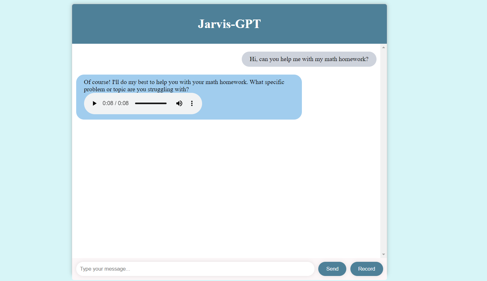

  

## What's Jarvis-GPT?

Jarvis-GPT is a simple concept chat application that uses the OpenAI API and gpt-3.5-turbo model for simulating an AI assistant named Jarvis. And Whisper AI model for voice recognition.

## How to use it?

1. Run `pip install -r requirements.txt` to install the necessary dependencies.
2. Create an `.env` file. Put your OpenAI `API_KEY` and the `PORT` where you want to run the app.
3. Follow [this](https://www.assemblyai.com/blog/how-to-run-openais-whisper-speech-recognition-model/) guide to installing whisper locally on your machine.
